# dubbogo中metrics的设计
最近因为要在[dubbo-go](https://github.com/apache/dubbo-go/)里面实现类似的这个`metrics`功能，于是花了很多时间去了解现在`dubbo`里面的`metrics`是怎么实现的。该部分，实际上是被放在一个独立的项目里面，即[metrics](https://github.com/alibaba/metrics.git)。

总体上来说，`dubbo`的`metrics`是一个从设计到实现都非常优秀的模块，理论上来说，大部分的`java`项目是可以直接使用`metrics`的。但也因为兼顾性能、扩展性等各种非功能特性，所以初看代码会有种无从下手的感觉。

今天这篇文章将会从比较大的概念和抽象上讨论一下`dubbogo`中的`metrics`模块的设计——实际上也就是`dubbo`中的`metrics`的设计。因为我仅仅是将`dubbo`里面的相关内容在`dubbogo`中复制一份。

目前`dubbogo`的`metrics`刚刚开始起步，第一个PR是`https://github.com/apache/dubbo-go/pull/278`。

## 总体设计

### Metric

要想理解`metrics`的设计，首先要理解，我们需要收集一些什么数据。我们可以轻易列举出来在`RPC`领域里面我们所关心的各种指标，诸如每个服务的调用次数，响应时间；如果更加细致一点，还有各种响应时间的分布，平均响应时间，999线……

但是上面列举的是从数据的内容上划分的。`metrics`在抽象上，则是摒弃了这种划分方式，而是**结合了数据的特性和表现形式**综合划分的。

从源码里面很容易找到这种划分的抽象。

`metrics`设计了`Metric`接口作为所有数据的顶级抽象：

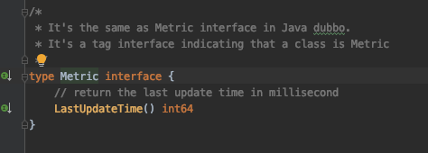

在`dubbo`里面，其比较关键的子接口是：

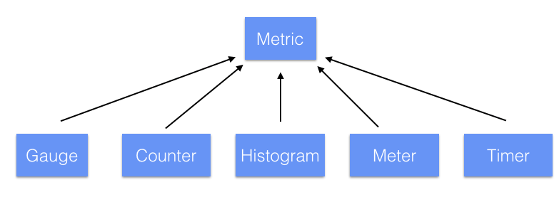

为了大家理解，这里我抄一下这些接口的用途：
- `Gauge`: 一种实时数据的度量，反映的是瞬态的数据，不具有累加性，例如当前`JVM`的线程数；
- `Counter`: 计数器型指标，适用于记录调用总量等类型的数据；
- `Histogram`: 直方分布指标，例如，可以用于统计某个接口的响应时间，可以展示50%, 70%, 90%的请求响应时间落在哪个区间内；
- `Meter`: 一种用于度量一段时间内吞吐率的计量器。例如，一分钟内，五分钟内，十五分钟内的qps指标；
- `Timer`: Timer相当于Meter+Histogram的组合，同时统计一段代码，一个方法的qps，以及执行时间的分布情况；

目前`dubbogo`只实现了`FastCompass`，它也是`Metric`的子类：

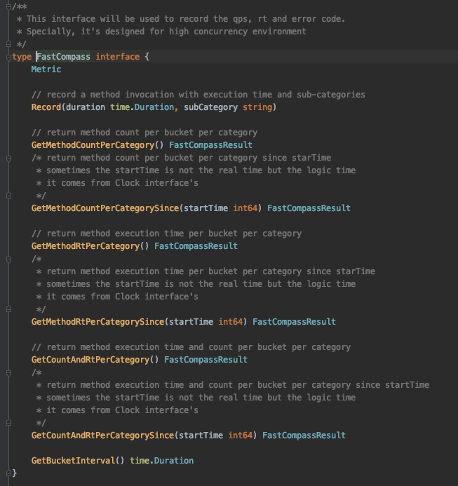

这个接口功能很简单，就是用于收集一段时间之内的`subCategory`执行的次数和响应时间。`subCategory`是一个比较宽泛的概念，无论是在`dubbo`还是在`dubbogo`里面，一个典型的`subCategory`就会是某个服务。

这里的设计要点在于，它是从什么角度上去做这些数据的抽象的。

很多人在开发这种采集数据的相关系统或者功能的时候，最容易陷入的就是从数据内容上做抽象，例如抽象一个接口，里面的方法就是获得服务的调用次数或者平均响应时间等。

这种抽象并非不可以，尤其是在简单系统里面，还非常好用。唯独在通用性和扩展性上要差很多。

### MetricManager

在我们定义了`Metric`之后，很容易就想到，我要有一个东西来管理这些`Metric`。这就是`MetricManager`——对应到`dubbo`里面的`IMetricManager`接口。

`MetricManager`接口目前在`dubbogo`里面还很简单：

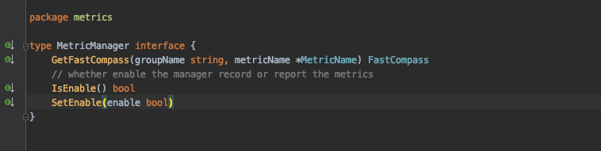

本质上来说，**我在前面提到的那些`Metric`的子类，都可以从这个`MetricManager`里面拿到**。它是对外的唯一入口。

因此无论是上报采集的数据，还是某些功能要用这些采集的数据，最重要的就是获得一个`MetricManager`的实例。例如我们最近正在开发的接入`Prometheus`就是拿到这个`MetriManger`实例，而后从里面拿到`FastCompass`的实例，而后采集这些数据：

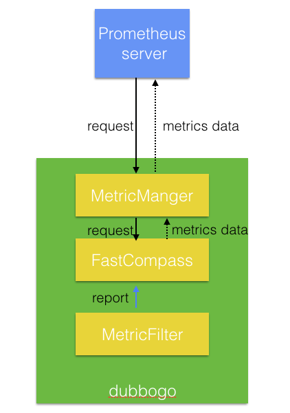

### MetricRegistry

`MetricRegistry`是一个对`Metric`集合的抽象。`MetricManager`的默认实现里面，就是使用`MetricRegistry`来管理`Metric`的:

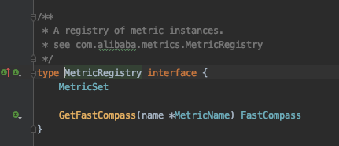

所以，本质上它就是提供了一些注册`Metric`然后再从里面捞出来的方法。

于是，这就有一个问题了：**为什么我在有了`MetricManager`之后，还有有一个`MetricRegistry`？似乎这两个功能有些重叠？**

答案大概是两个方面：
1. `MetricManager`除了管理所有的`Metric`之外，还承担着额外的功能，这些功能典型的就是`IsEnabled`。而实际上，在未来我们会赋予它管理生命周期的责任，比如说在`dubbo`里面，该接口就还有一个`clear`方法；
2. `metrics`里面还有一个`group`的概念，而这只能由`MetricManager`来进行管理，至少交给`MetricRegistry`是不合适的。

`metrics`的`group`说起来也很简单。比如在`dubbo`框架里面采集的数据，都会归属于`dubbo`这个`group`。也就是说，如果我想将非框架层面采集的数据——比如纯粹的业务数据——分隔出来，就可以借用一个`business group`。又或者我采集到的机器自身的数据，可以将其归类到`system`这个`group`下。

所以`MetricManger`和`MetricRegistry`的关系是：

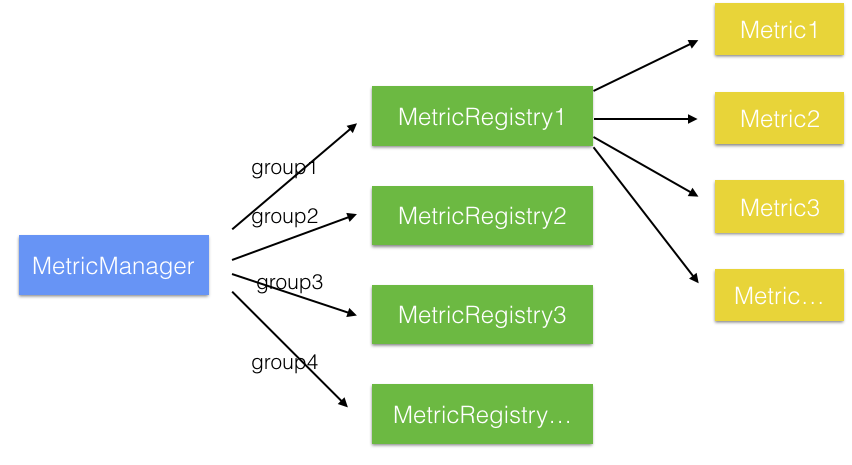

### Clock

`Clock`抽象是一个初看没什么用，再看又会觉得太机智了的抽象。`Clock`里面就两个方法：

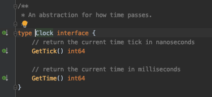

一个是获得时间戳，另外一个则是获得时间周期(Tick)。比如通常采集数据可能是每一分钟采集一次，所以你得知道现在处在哪个时间周期里面。`Clock`就提供了这种抽象。

很多人在实现自己的这种`metrics`的框架的时候，大多数都是直接使用系统的时钟，也就是系统的时间戳。于是所有的`Metic`在采集数据或者上报数据的时候，不得不自己去处理这种时钟方面的问题。

这样不同的`Metric`之间就很难做到时钟的同步。比如说可能在某个`Metric1`里面，采集周期是当前这一分钟，而`Metric2`是当前这一分钟的第三十秒到下一分钟的第三十秒。虽然它们都是一分钟采集一次，但是这个周期就对不上了。

另外一个有意思的地方在于，`Clock`提供的这种抽象，允许我们不必真的按照现实时间的时间戳来处理。比如说，可以考虑按照`CPU`的运行时间来设计`Clock`的实现。

## 例子

就用这一次PR的内容来展示一下这个设计。

在`dubbogo`里面这次实现了`metricsFilter`，它主要就是收集调用次数和响应时间，其核心是：

`report`其实就是把`metrics` `reports`给`MetricManager`：

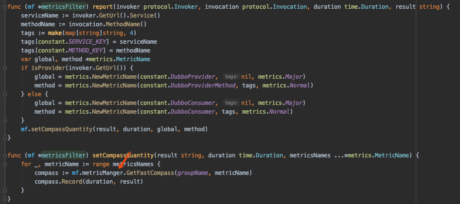

所以，这里面可以看出来，如果我们要收集什么数据，也是要先获得`MetricManager`的实例。

`FastCompass`的实现里面会将这一次调用的服务及其响应时间保存下来。而后在需要的时候再取出来。

所谓的需要的时候，通常就是上报给监控系统的时候。比如前面的提到的上报给`Prometheus`。

所以这个流程可以抽象表达为：

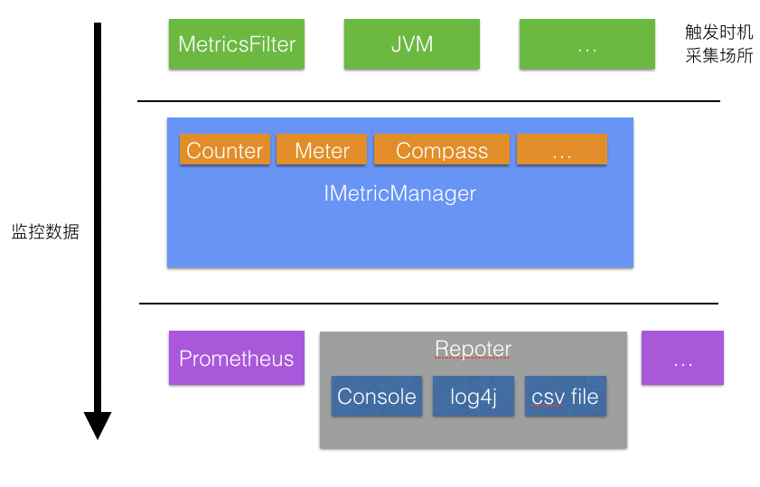

这是一个更加宽泛的抽象。也就是意味着，我们除了可以从这个`metricFilter`里面收集数据，也可以从自身的业务里面去收集数据。比如说统计某段代码的执行时间，一样可以使用`FastCompass`。

而除了`Prometheus`，如果用户自己的公司里面有监控框架，那么他们可以自己实现自己的上报逻辑。而上报的数据则只需要拿到`MetricManager`实例就能拿到。

## 总结

本质上来说，整个`metrics`可以看做是一个巨大无比的`provider-conumer`模型。

不同的数据会在不同的地方和不同时间点上被采集。有些人在读这些源码的时候会有点困惑，**就是这些数据什么时间点会被采集呢？**

它们只会在两类时间点采集：
1. 实时采集。如我上面举例的`metricsFilter`，一次调用过来，它的数据就被采集了；
2. 另外一个则是如同`Prometheus`。每次`Prometheus`触发了`collect`方法，那么它就会把每种（如`Meter`, `Gauge`）里面的数据收集过来，然后上报，可以称为是定时采集；

`dubbo`里面采集了非常多的数据：

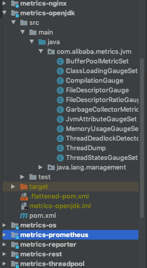

这些具体的实现，我就不一一讨论了，大家有兴趣可以去看看源码。这些数据，也是我们`dubbogo`后面要陆续实现的东西，欢迎大家持续关注，或者来贡献代码。